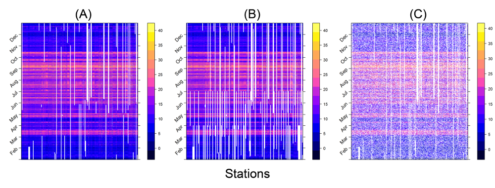
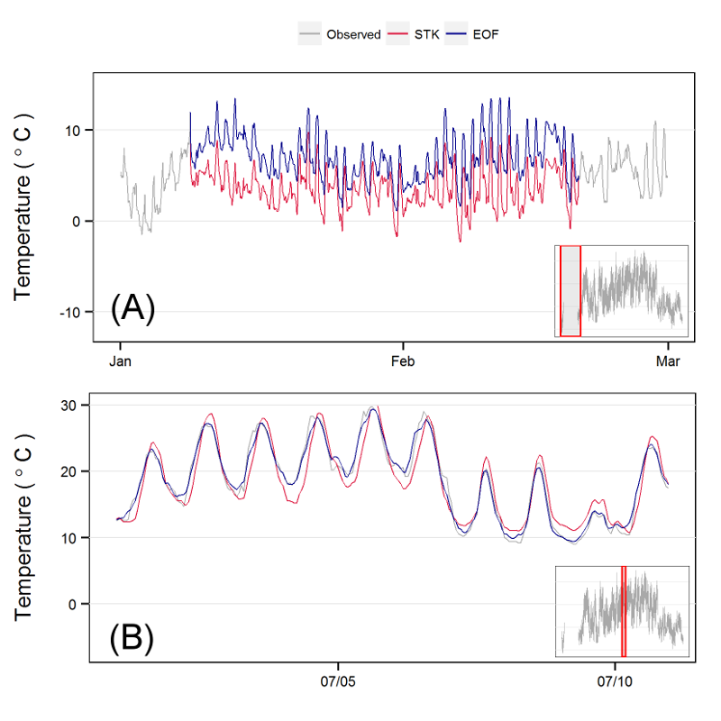
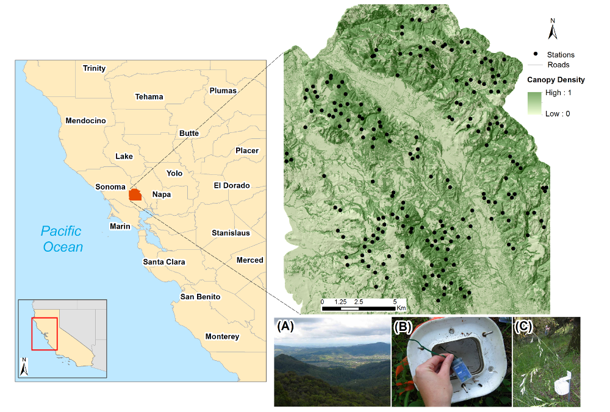

# Spatiotemporal Reconstruction of Missing Forest Microclimate Measurements

This repository contains the R scripts developed for the data processing and analysis steps used with the microclimate temperature 
measurements recorded in the Sonoma study system, California. 
This repository is officially referenced in the publication by Tonini et al. (2016), 
[Spatio-temporal reconstruction of missing forest microclimate measurements](http://www.sciencedirect.com/science/article/pii/S0168192315007558?via%3Dihub).

## Credits and Contacts

Francesco Tonini: <ftonini84@gmail.com>

## LICENSE

[Apache 2.0](LICENSE)
